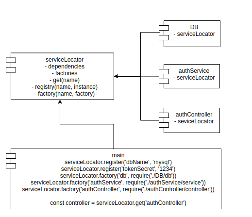

# Server locator
### General infomation
```
This is a demo project about service locator pattern
```
### Overview Architecture


### File Structure
```bash
.
├── authController
│   └── controller.js
├── authService
│   └── service.js
├── DB
│   └── db.js
├── index.js
├── package.json
├── package-lock.json
├── README.md
├── serviceLocator.js
└── test
    └── service.test.js
```
### Technical Support or Questions
If you have questions or need help integrating the product please "thanh29695@gmail.com" instead of opening an issue.

